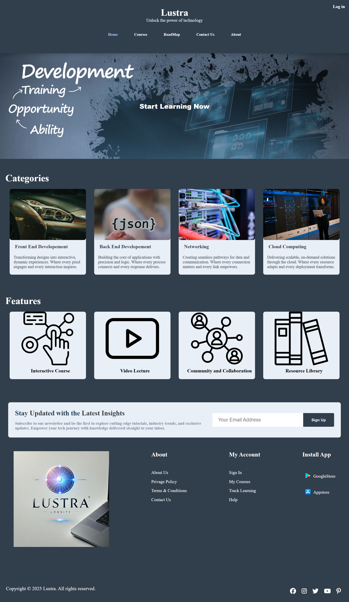
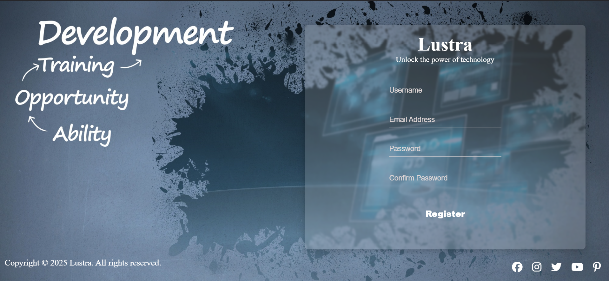

# Lustra

## **Table of Contents**

1. [Overview](#features)
2. [Demo](#Demo)
3. [Features](#features)
4. [File Structure](#File-Structure)    
5. [Technologies Used](#technologies-used)
6. [Setup Instructions](#installation)
7. [Running Locally](#Running-Locally)


## Overview
Our website is a dynamic and user-friendly platform designed to provide an exceptional experience for visitors.
 Whether you're exploring, learning and practicing **Technology**, our site offers seamless navigation, engaging content, and responsive design for optimal viewing across all devices.

### **Demo**
**Home Page**:
Presents a header section that contains website title navbar for menu and other for subscribe, a presentative background, List of categories and other for Features, in Bottom of page there are a newslettre section and links section.
 <br><br>
**Log In Page**:
 <br><br>
**Register Page**:
 <br>


---

## Features
- Intuitive Design: Easy-to-navigate layout tailored to your needs.
- Comprehensive Content: In-depth resources and up-to-date information on technology.
- Interactive Features: Tools and functionalities for enhanced user interaction.
- Secure and Reliable: Prioritizing user data protection and accessibility.

---

## File Structure
Lustra/ # project_Folder <br>
├── index.html # Home HTML file <br>
├── login.html # Login HTML file <br>
├── register.html # register HTML file <br>
├── style.css # CSS file for styling <br>
├── script.js # JavaScript file for interactivity <br>
├── README.md # Project documentation <br>
└── img/ # Images_Folder <br>
    &nbsp;&nbsp;&nbsp;&nbsp;&nbsp;&nbsp;&nbsp;└── homeImg/ # Home Images Folder <br>


---

## Technologies Used
- **HTML5:** Structure and content.
- **CSS3:** Styling and responsive design.
- **JavaScript:** Dynamic functionality (e.g., search and API calls).

---

## Setup Instructions
1. Clone this repository:
   ```bash
   git clone <rhttps://github.com/TaoufikBenlhosniDev/Lustra.git>

### Running Locally
- Navigate to `http://localhost:5500` (or your configured port) to access the website.

---
